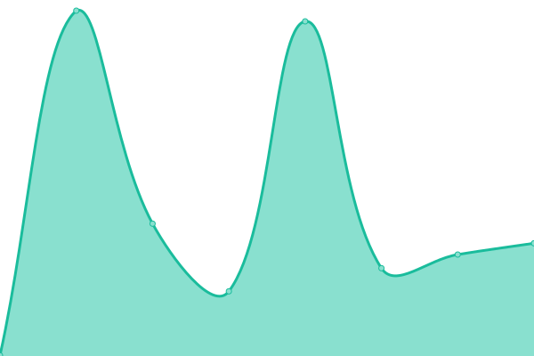
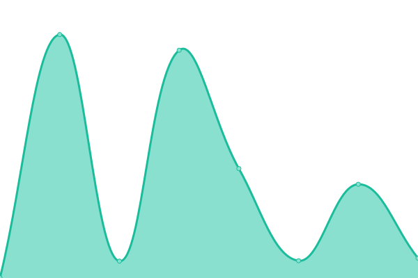

# [📈 Live Status](https://demo.upptime.js.org): <!--live status--> **🟧 Partial outage**

This repository contains the open-source uptime monitor and status page for [Upptime](https://upptime.js.org), powered by [Upptime](https://github.com/upptime/upptime).

With [Upptime](https://upptime.js.org), you can get your own unlimited and free uptime monitor and status page, powered entirely by a GitHub repository. We use [Issues](https://github.com/upptime/upptime/issues) as incident reports, [Actions](https://github.com/dpkg-i-foo-deb/upptime/actions) as uptime monitors, and [Pages](https://demo.upptime.js.org) for the status page.

<!--start: status pages-->
<!-- This summary is generated by Upptime (https://github.com/upptime/upptime) -->
<!-- Do not edit this manually, your changes will be overwritten -->
<!-- prettier-ignore -->
| URL | Status | History | Response Time | Uptime |
| --- | ------ | ------- | ------------- | ------ |
|  [Site Principal](https://vc-soft.com) | Activo | [site-principal.yml](https://github.com/vc-soft/upptime/commits/HEAD/history/site-principal.yml) | 

 1483ms
     
 | 

<a href="https://status.vc-soft.com/history/site-principal">96.89%</a>
    

|  Portal de Autenticación | Activo | [portal-de-autenticacion.yml](https://github.com/vc-soft/upptime/commits/HEAD/history/portal-de-autenticacion.yml) | 

 204ms
     
 | 

<a href="https://status.vc-soft.com/history/portal-de-autenticacion">100.00%</a>
    

|  VPN Soporte | Activo | [vpn-soporte.yml](https://github.com/vc-soft/upptime/commits/HEAD/history/vpn-soporte.yml) | 

 941ms
     
 | 

<a href="https://status.vc-soft.com/history/vpn-soporte">61.13%</a>
    

|  VPN Sodimac | Activo | [vpn-sodimac.yml](https://github.com/vc-soft/upptime/commits/HEAD/history/vpn-sodimac.yml) | 

 2518ms
     
 | 

<a href="https://status.vc-soft.com/history/vpn-sodimac">61.13%</a>
    

|  VPN Davivienda | Activo | [vpn-davivienda.yml](https://github.com/vc-soft/upptime/commits/HEAD/history/vpn-davivienda.yml) | 

 1351ms
     
 | 

<a href="https://status.vc-soft.com/history/vpn-davivienda">61.32%</a>
    

|  AWX | Activo | [awx.yml](https://github.com/vc-soft/upptime/commits/HEAD/history/awx.yml) | 

 495ms
     
 | 

<a href="https://status.vc-soft.com/history/awx">99.53%</a>
    

|  Jenkins | Activo | [jenkins.yml](https://github.com/vc-soft/upptime/commits/HEAD/history/jenkins.yml) | 

 465ms
     
 | 

<a href="https://status.vc-soft.com/history/jenkins">98.99%</a>
    

|  Mail Gateway | Activo | [mail-gateway.yml](https://github.com/vc-soft/upptime/commits/HEAD/history/mail-gateway.yml) | 

 171ms
     
 | 

<a href="https://status.vc-soft.com/history/mail-gateway">100.00%</a>
    

|  Mail UI | Activo | [mail-ui.yml](https://github.com/vc-soft/upptime/commits/HEAD/history/mail-ui.yml) | 

 835ms
     
 | 

<a href="https://status.vc-soft.com/history/mail-ui">99.55%</a>
    

|  N8N | Activo | [n8-n.yml](https://github.com/vc-soft/upptime/commits/HEAD/history/n8-n.yml) | 

 391ms
     
 | 

<a href="https://status.vc-soft.com/history/n8-n">30.81%</a>
    

|  Apache Guacamole 🥑 | Activo | [apache-guacamole.yml](https://github.com/vc-soft/upptime/commits/HEAD/history/apache-guacamole.yml) | 

 163ms
     
 | 

<a href="https://status.vc-soft.com/history/apache-guacamole">100.00%</a>
    

|  [Training](https://training.vc-soft.com) | Activo | [training.yml](https://github.com/vc-soft/upptime/commits/HEAD/history/training.yml) | 

 530ms
     
 | 

<a href="https://status.vc-soft.com/history/training">100.00%</a>
    

|  CRM | Inactivo | [crm.yml](https://github.com/vc-soft/upptime/commits/HEAD/history/crm.yml) | 

 12822ms
     
 | 

<a href="https://status.vc-soft.com/history/crm">80.85%</a>
    

|  Invoice Colombia | Inactivo | [invoice-colombia.yml](https://github.com/vc-soft/upptime/commits/HEAD/history/invoice-colombia.yml) | 

 15867ms
     
 | 

<a href="https://status.vc-soft.com/history/invoice-colombia">81.97%</a>
    

|  Invoice Chile | Inactivo | [invoice-chile.yml](https://github.com/vc-soft/upptime/commits/HEAD/history/invoice-chile.yml) | 

 11434ms
     
 | 

<a href="https://status.vc-soft.com/history/invoice-chile">80.22%</a>
    

|  Invoice Argentina | Inactivo | [invoice-argentina.yml](https://github.com/vc-soft/upptime/commits/HEAD/history/invoice-argentina.yml) | 

 12961ms
     
 | 

<a href="https://status.vc-soft.com/history/invoice-argentina">78.35%</a>
    

|  Portal TBK Clientes | Inactivo | [portal-tbk-clientes.yml](https://github.com/vc-soft/upptime/commits/HEAD/history/portal-tbk-clientes.yml) | 

 331ms
     
 | 

<a href="https://status.vc-soft.com/history/portal-tbk-clientes">98.30%</a>
    

|  Portal TBK Clientes Sandbox | Activo | [portal-tbk-clientes-sandbox.yml](https://github.com/vc-soft/upptime/commits/HEAD/history/portal-tbk-clientes-sandbox.yml) | 

 272ms
     
 | 

<a href="https://status.vc-soft.com/history/portal-tbk-clientes-sandbox">100.00%</a>
    

|  Portal TBK Partners | Activo | [portal-tbk-partners.yml](https://github.com/vc-soft/upptime/commits/HEAD/history/portal-tbk-partners.yml) | 

 375ms
     
 | 

<a href="https://status.vc-soft.com/history/portal-tbk-partners">100.00%</a>
    

|  Portal TBK Partners Sandbox | Activo | [portal-tbk-partners-sandbox.yml](https://github.com/vc-soft/upptime/commits/HEAD/history/portal-tbk-partners-sandbox.yml) | 

 678ms
     
 | 

<a href="https://status.vc-soft.com/history/portal-tbk-partners-sandbox">100.00%</a>
    

<!--end: status pages-->

[**Visit our status website →**](https://demo.upptime.js.org)

## 📄 License

- Powered by: [Upptime](https://github.com/upptime/upptime)
- Code: [MIT](./LICENSE) © [Anand Chowdhary](https://anandchowdhary.com), supported by [Pabio](https://pabio.com)
- Data in the `./history` directory: [Open Database License](https://opendatacommons.org/licenses/odbl/1-0/)
